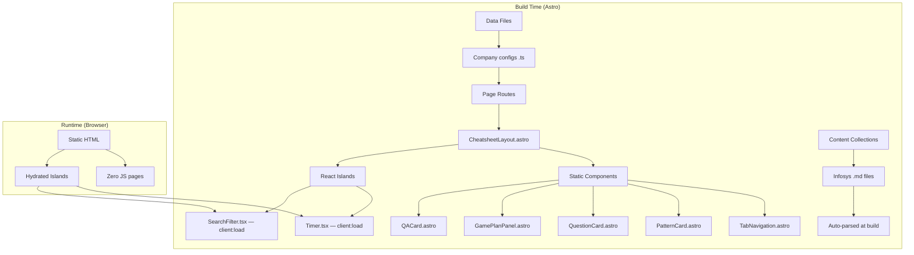
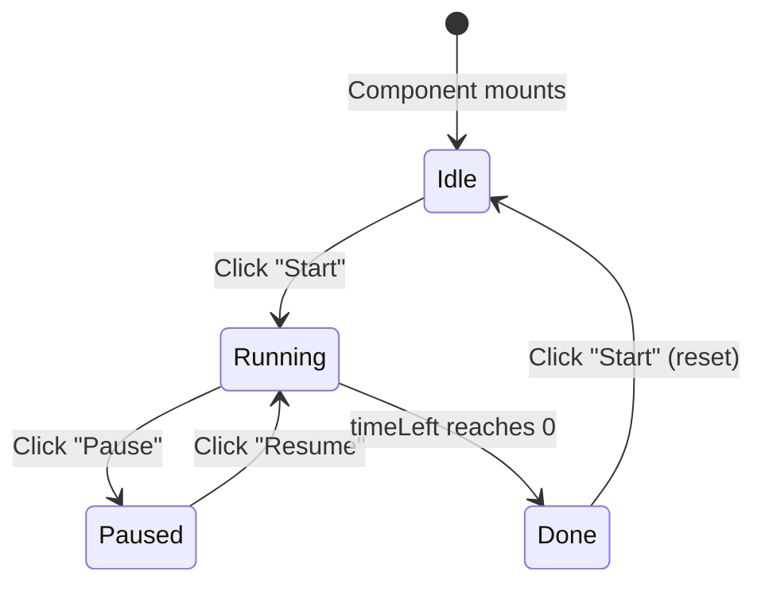

# Design Document: Company Cheatsheets

## Overview

This feature creates 6 company-specific interview cheatsheet pages (Bank of America, Allstate, Shutterfly, Lowe's, Truist, and Infosys Playbook) within a single Astro 5 project. Each page is a route (`/bofa`, `/allstate`, `/shutterfly`, `/lowes`, `/truist`, `/infosys`) that renders to static HTML at build time — zero client JavaScript by default, with React islands hydrated only for interactive components (Timer, SearchFilter).

Five pages follow the **timed-assessment pattern**: tabbed navigation, countdown timer, pattern cards with build-time syntax highlighting, filterable question cards, and a game plan panel. The sixth page (Infosys) follows a **knowledge-reference pattern**: tabbed navigation, expandable Q&A accordion cards, global cross-tab search, and no timer — with content sourced from existing markdown files via Astro content collections.

The architecture leverages Astro's strengths: component-based layouts, build-time rendering (Shiki for syntax highlighting, no CDN needed), CSS scoping, and selective hydration. The user experience is identical to the original design — the apps look and behave the same way — but the developer experience is dramatically better: shared layout, no code duplication, type-safe content, and a single build command.

## Architecture

### High-Level Structure

```
cheatsheets/                         (project root)
├── astro.config.mjs
├── package.json
├── tsconfig.json
├── src/
│   ├── layouts/
│   │   └── CheatsheetLayout.astro   (shared layout: header, tabs, timer slot, footer)
│   ├── components/
│   │   ├── TabNavigation.astro      (static tab bar)
│   │   ├── PatternCard.astro        (static pattern card)
│   │   ├── QuestionCard.astro       (static question card)
│   │   ├── GamePlanPanel.astro      (static game plan)
│   │   ├── QACard.astro             (static expandable Q&A card)
│   │   ├── Timer.tsx                (React island — client:load)
│   │   └── SearchFilter.tsx         (React island — client:load)
│   ├── pages/
│   │   ├── index.astro              (landing/redirect or Wells Fargo)
│   │   ├── bofa.astro
│   │   ├── allstate.astro
│   │   ├── shutterfly.astro
│   │   ├── lowes.astro
│   │   ├── truist.astro
│   │   └── infosys.astro
│   ├── content/
│   │   ├── config.ts                (content collection schema)
│   │   └── infosys/                 (markdown files for Infosys Playbook)
│   │       ├── java.md
│   │       ├── spring.md
│   │       ├── sql.md
│   │       ├── react-frontend.md
│   │       ├── http.md
│   │       ├── cloud-sdlc.md
│   │       ├── coding.md
│   │       └── git.md
│   ├── data/
│   │   ├── bofa.ts                  (patterns, questions, game plan config)
│   │   ├── allstate.ts
│   │   ├── shutterfly.ts
│   │   ├── lowes.ts
│   │   ├── truist.ts
│   │   └── types.ts                 (shared TypeScript interfaces)
│   └── styles/
│       └── global.css               (shared base styles + CSS custom properties)
├── Infosys Playbook/                (source markdown — read-only reference)
│   └── *.md
└── public/
    └── (static assets if needed)
```

### Architecture Diagram



### Key Architectural Decisions

| Decision | Rationale |
|----------|-----------|
| Single Astro project | Eliminates code duplication across 6 folder sets. Shared layout, components, and styles. |
| Route-based pages | Each company is a page file (`/bofa.astro`). Clean URLs, standard Astro routing. |
| Shared layout component | `CheatsheetLayout.astro` handles header, tab container, timer slot, footer. Company pages pass props. |
| React islands for interactivity | Timer and SearchFilter need client-side state. Everything else is static HTML. |
| `client:load` directive | Timer and search need to be interactive immediately on page load. |
| Content collections for Infosys | Astro parses markdown at build time with type safety. No manual HTML conversion. |
| Shiki (built-in) for syntax highlighting | Build-time highlighting. Zero runtime JS for code blocks. No CDN dependency. |
| CSS custom properties per page | Each page sets `--color-accent` (and optional secondary) on the root element via inline style or body class. Global CSS references these variables. |
| TypeScript data files | Type-safe company configs. Shared interfaces for patterns, questions, game plan. |

### Build Output

After `astro build`, the `dist/` folder contains:

```
dist/
├── index.html
├── bofa/index.html
├── allstate/index.html
├── shutterfly/index.html
├── lowes/index.html
├── truist/index.html
├── infosys/index.html
└── _astro/
    ├── Timer.{hash}.js        (hydrated island bundle)
    ├── SearchFilter.{hash}.js (hydrated island bundle)
    └── global.{hash}.css      (bundled styles)
```

Each page is fully static HTML with pre-rendered syntax highlighting. Only pages with Timer or SearchFilter load any JavaScript.

## Components and Interfaces

### Layout Component

**`CheatsheetLayout.astro`** — The shared wrapper for all 6 pages.

```typescript
// Props interface
interface Props {
  title: string;              // Page <title> and header h1
  subtitle: string;           // Header description line
  accentColor: string;        // CSS --color-accent value (hex)
  accentSecondary?: string;   // Optional --color-accent-secondary
  tabs: TabConfig[];          // Tab labels and panel slot names
  timerMinutes?: number;      // If provided, renders Timer island. Omit for Infosys.
  hasSearch?: boolean;        // If true, renders SearchFilter island
}

interface TabConfig {
  id: string;                 // Used for panel ID: "tab-{id}"
  label: string;              // Display text on tab button
}
```

**Responsibilities:**
- Sets CSS custom properties on `<body>` via `style` attribute
- Renders header with title, subtitle
- Conditionally renders `<Timer>` React island (only if `timerMinutes` is provided)
- Renders `<TabNavigation>` with tab configs
- Provides named `<slot>`s for each tab panel
- Conditionally renders `<SearchFilter>` React island
- Includes global CSS import

### Static Astro Components

| Component | Props | Renders |
|-----------|-------|---------|
| `TabNavigation.astro` | `tabs: TabConfig[]` | Horizontal pill-container tab bar with ARIA roles, keyboard nav script |
| `PatternCard.astro` | `title, lang, description, code, metaTags[]` | Card with badge, desc, Shiki-highlighted code, meta tags |
| `QuestionCard.astro` | `name, diff, hint, lang, code` | Card with header (name, badge, hint) and Shiki-highlighted code body |
| `GamePlanPanel.astro` | `allocations[], strategies[], keywords[]` | Time cards grid + strategy cards + keyword grid |
| `QACard.astro` | `question, answer (HTML)` | Expandable accordion card with click-to-toggle |

### React Island Components

**`Timer.tsx`** — Hydrated with `client:load`

```typescript
interface TimerProps {
  durationMinutes: number;  // Initial countdown value
}

// State machine: idle → running → paused → running → done → idle
// Renders: MM:SS display + Start/Pause/Resume button
```

**`SearchFilter.tsx`** — Hydrated with `client:load`

```typescript
interface SearchFilterProps {
  targetSelector: string;     // CSS selector for filterable cards
  searchFields: string[];     // data-attributes to search against
  scope?: 'active-panel' | 'all-panels';  // Infosys uses 'all-panels'
}

// Renders: text input that filters cards by substring match
// Dispatches custom event or directly manipulates DOM visibility
```

### Tab Switching Logic

Tab switching is handled by a small inline `<script>` in `TabNavigation.astro` (not a React island — it's simple DOM manipulation that doesn't need React's overhead):

```javascript
// Inline script in TabNavigation.astro (runs once, no framework needed)
const tabs = document.querySelectorAll('[role="tab"]');
const panels = document.querySelectorAll('[role="tabpanel"]');

function activateTab(tab) {
  tabs.forEach(t => { t.classList.remove('active'); t.setAttribute('aria-selected', 'false'); });
  panels.forEach(p => p.classList.remove('active'));
  tab.classList.add('active');
  tab.setAttribute('aria-selected', 'true');
  document.getElementById(tab.getAttribute('aria-controls')).classList.add('active');
}

tabs.forEach(tab => tab.addEventListener('click', () => activateTab(tab)));

// Keyboard navigation (arrow keys with wrapping)
document.querySelector('.tabs').addEventListener('keydown', (e) => {
  const tabList = [...tabs];
  const idx = tabList.indexOf(document.activeElement);
  if (idx === -1) return;
  let next;
  if (e.key === 'ArrowRight') next = (idx + 1) % tabList.length;
  else if (e.key === 'ArrowLeft') next = (idx - 1 + tabList.length) % tabList.length;
  else return;
  e.preventDefault();
  tabList[next].focus();
  activateTab(tabList[next]);
});
```

### Timer State Machine



### QA Card Toggle (Infosys)

The expand/collapse is handled by a small inline script in `QACard.astro`:

```javascript
// Click handler on .qa-card-header
function toggleCard(card) {
  card.classList.toggle('expanded');
  const body = card.querySelector('.qa-body');
  if (card.classList.contains('expanded')) {
    body.style.maxHeight = body.scrollHeight + 'px';
  } else {
    body.style.maxHeight = '0';
  }
}
```

## Data Models

### Shared TypeScript Interfaces (`src/data/types.ts`)

```typescript
export interface CompanyConfig {
  slug: string;                    // Route slug: "bofa", "allstate", etc.
  title: string;                   // Header title
  subtitle: string;                // Header subtitle/description
  accentColor: string;             // Primary accent hex
  accentSecondary?: string;        // Optional secondary accent hex
  timerMinutes?: number;           // Timer duration (omit for Infosys)
  tabs: TabConfig[];               // Tab configuration
}

export interface TabConfig {
  id: string;
  label: string;
}

export interface PatternCard {
  title: string;                   // Pattern name
  lang: 'java' | 'sql' | 'javascript' | 'python' | 'bash' | 'typescript';
  description: string;             // ≤200 chars
  code: string;                    // Raw code (Shiki highlights at build time)
  metaTags: string[];              // 1–5 keyword tags
}

export interface PatternSection {
  label: string;                   // Section heading (e.g., "Window Functions")
  cards: PatternCard[];
}

export interface QuestionItem {
  name: string;                    // Problem title
  diff: 'easy' | 'medium' | 'hard';
  hint: string;                    // ≤80 chars
  lang: string;                    // Language for syntax highlighting
  code: string;                    // Full solution code
}

export interface TimeAllocation {
  label: string;                   // e.g., "Q1"
  type: string;                    // e.g., "SQL"
  minutes: number;                 // 1–45
  highlight?: boolean;             // Visual emphasis
}

export interface StrategyCard {
  title: string;
  steps: string[];                 // 3–7 ordered steps
  highlightText?: string;          // Optional callout
}

export interface GamePlanConfig {
  allocations: TimeAllocation[];
  strategies: StrategyCard[];
  keywords: string[];              // 6–20 topic terms
}
```

### Content Collection Schema (`src/content/config.ts`)

```typescript
import { defineCollection, z } from 'astro:content';

const infosys = defineCollection({
  type: 'content',
  schema: z.object({
    title: z.string(),
    order: z.number(),
    lang: z.string().default('java'),  // Primary language for highlighting
  }),
});

export const collections = { infosys };
```

Each Infosys markdown file has frontmatter:

```yaml
---
title: "Java"
order: 1
lang: "java"
---

# What is the difference between JDK, JVM, & JRE?

- **JDK** — Java Development Kit...
...
```

Astro parses these at build time. The `infosys.astro` page queries the collection and renders Q&A cards from the parsed content.

### Company Configuration Summary

| Page | Route | Timer | Tabs | Accent Color |
|------|-------|-------|------|--------------|
| BofA | `/bofa` | 90 min | SQL Patterns, Java/Core Patterns, Likely Questions, Game Plan | #012169 (navy) + #E31837 (red) |
| Allstate | `/allstate` | 60 min | TDD Patterns, Java/Spring Patterns, Likely Questions, Game Plan | #003DA5 (blue) + #FF6900 (orange) |
| Shutterfly | `/shutterfly` | 90 min | Array/String Patterns, DP/Math Patterns, Likely Questions, Game Plan | #6B2D8B (purple) + #00B2A9 (teal) |
| Lowe's | `/lowes` | 90 min | Java 8/Core Patterns, Microservices/Kafka Patterns, Likely Questions, Game Plan | #004990 (blue) |
| Truist | `/truist` | 60 min | Java/SQL Patterns, Banking Domain Patterns, Likely Questions, Game Plan | #532E8A (purple) |
| Infosys | `/infosys` | None | Java, Spring, SQL, React/Frontend, HTTP, Cloud/SDLC, Coding, Git | #007CC3 (blue) + #00A5E3 (light blue) |

### Page Component Example (`src/pages/bofa.astro`)

```astro
---
import CheatsheetLayout from '../layouts/CheatsheetLayout.astro';
import PatternCard from '../components/PatternCard.astro';
import QuestionCard from '../components/QuestionCard.astro';
import GamePlanPanel from '../components/GamePlanPanel.astro';
import { bofaConfig, bofaSqlPatterns, bofaJavaPatterns, bofaQuestions, bofaGamePlan } from '../data/bofa';
---

<CheatsheetLayout
  title="Bank of America HireVue OA — Cheat Sheet"
  subtitle="HireVue OA — 90 min · Self-Intro + 2 Coding (Easy + Medium) + Explanation Video + Fitment"
  accentColor="#012169"
  accentSecondary="#E31837"
  tabs={bofaConfig.tabs}
  timerMinutes={90}
  hasSearch={true}
>
  <div slot="tab-sql">
    {bofaSqlPatterns.map(section => (
      <Fragment>
        <div class="section-label">{section.label}</div>
        <div class="pattern-grid">
          {section.cards.map(card => <PatternCard {...card} />)}
        </div>
      </Fragment>
    ))}
  </div>

  <div slot="tab-java">
    {bofaJavaPatterns.map(section => (
      <Fragment>
        <div class="section-label">{section.label}</div>
        <div class="pattern-grid">
          {section.cards.map(card => <PatternCard {...card} />)}
        </div>
      </Fragment>
    ))}
  </div>

  <div slot="tab-questions">
    {bofaQuestions.map(q => <QuestionCard {...q} />)}
  </div>

  <div slot="tab-plan">
    <GamePlanPanel {...bofaGamePlan} />
  </div>
</CheatsheetLayout>
```

### Infosys Page with Content Collections (`src/pages/infosys.astro`)

```astro
---
import CheatsheetLayout from '../layouts/CheatsheetLayout.astro';
import QACard from '../components/QACard.astro';
import { getCollection } from 'astro:content';

const topics = await getCollection('infosys');
const sorted = topics.sort((a, b) => a.data.order - b.data.order);

const tabs = sorted.map(t => ({ id: t.slug, label: t.data.title }));
---

<CheatsheetLayout
  title="Infosys Playbook — Full-Stack Interview Knowledge Base"
  subtitle="Java · Spring · SQL · React · HTTP · Cloud · Coding · Git"
  accentColor="#007CC3"
  accentSecondary="#00A5E3"
  tabs={tabs}
  hasSearch={true}
>
  {sorted.map(async (topic) => {
    const { Content } = await topic.render();
    return (
      <div slot={`tab-${topic.slug}`}>
        <!-- Q&A cards rendered from parsed markdown headings -->
      </div>
    );
  })}
</CheatsheetLayout>
```

The Infosys content collection markdown is parsed by Astro at build time. Each H1 heading becomes a Q&A card question, and the content between headings becomes the answer body — rendered with Shiki syntax highlighting for code blocks.

## Correctness Properties

*A property is a characteristic or behavior that should hold true across all valid executions of a system — essentially, a formal statement about what the system should do. Properties serve as the bridge between human-readable specifications and machine-verifiable correctness guarantees.*

### Property 1: Tab Switching Invariant

*For any* app and *for any* tab button click, exactly one panel SHALL have the `active` class (making it visible) AND exactly one tab button SHALL have the `active` class, AND the visible panel SHALL correspond to the clicked tab button.

**Validates: Requirements 2.2, 2.3**

### Property 2: Keyboard Tab Navigation Wraps Correctly

*For any* tab that currently has focus, pressing the right arrow key SHALL move focus to the next tab (wrapping from last to first), and pressing the left arrow key SHALL move focus to the previous tab (wrapping from first to last).

**Validates: Requirements 2.10**

### Property 3: Timer Display Format

*For any* integer time value between 0 and the maximum configured duration (in seconds), the timer display SHALL show the value formatted as `MM:SS` where MM is `Math.floor(value / 60)` and SS is `(value % 60).toString().padStart(2, '0')`.

**Validates: Requirements 3.1**

### Property 4: Timer Pause/Resume Round-Trip

*For any* running timer state with time remaining > 0, pausing and then immediately resuming SHALL preserve the displayed time value (the time shown after resume equals the time shown at pause).

**Validates: Requirements 3.3, 3.4**

### Property 5: Card Rendering Completeness

*For any* question data object with valid `name`, `diff`, `hint`, `lang`, and `code` fields, the rendered Question_Card HTML SHALL contain: the name text, a badge element with the diff value, the hint text, and a `<code>` block containing the code content.

**Validates: Requirements 4.1, 5.1**

### Property 6: Search Filter Correctness

*For any* search query string and *for any* set of cards (Question_Cards or QA_Cards), the set of visible cards after filtering SHALL be exactly the set of cards whose name/question attribute contains the query as a case-insensitive substring. If the query is empty, all cards SHALL be visible.

**Validates: Requirements 5.2, 14.5**

### Property 7: Game Plan Time Allocation Invariant

*For any* timed-assessment app, the sum of all time allocation values displayed in the Game_Plan_Panel SHALL equal the app's configured timer duration in minutes.

**Validates: Requirements 6.1**

### Property 8: Q&A Card Toggle Round-Trip

*For any* Q&A card in the Infosys app, clicking the card header twice SHALL return the card to its original collapsed state (the card's expanded/collapsed state is toggled on each click, and two clicks form an identity operation).

**Validates: Requirements 14.4, 14.10**

## Error Handling

### Build-Time Syntax Highlighting (Shiki)

- **Strategy**: Astro's built-in Shiki integration highlights code at build time. There is no runtime CDN dependency.
- **Fallback**: If a language isn't recognized by Shiki, the code block renders as plain monospaced text (same as the original CDN-failure graceful degradation, but this case is caught at build time).
- **User impact**: Code is always pre-highlighted in the HTML. No flash of unstyled code.

### Content Collection Parsing Errors (Infosys)

- **Strategy**: Astro validates content collections against the Zod schema at build time. Malformed frontmatter or missing required fields cause a build error with a clear message.
- **Implementation**: The `config.ts` schema enforces `title` (required) and `order` (required number). Build fails fast if content is invalid.
- **Developer impact**: Errors are caught during development, never at runtime.

### Empty Filter Results

- **Strategy**: The `SearchFilter.tsx` component displays a "No results found" message when the filter matches zero cards.
- **Implementation**: After filtering, count visible cards. If zero, render a `.no-results` element.

### Timer Edge Cases

- **Zero reached**: Timer stops, displays "00:00" in red, button resets to "Start".
- **Multiple rapid clicks**: React state management prevents race conditions. `useRef` for interval ID ensures only one interval runs.
- **Page refresh**: Timer state is not persisted (intentional — practice sessions, not real assessments).

### Hydration Failures

- **Strategy**: If JavaScript fails to load (network issue, browser extension blocking), the page still renders all static content (patterns, questions, game plan). Only Timer and SearchFilter become non-interactive.
- **Graceful degradation**: All code blocks, pattern cards, and content are in the static HTML. The page is fully readable without JS.

## Testing Strategy

### Unit Tests (Example-Based with Vitest)

Unit tests verify specific concrete behaviors:

- Each company data file exports valid typed data matching the interfaces
- Timer formatting function produces correct MM:SS for known inputs
- Company configs have correct accent colors, timer durations, and tab labels
- Content completeness: each company data file includes minimum required patterns and questions per requirements
- Infosys content collection files have valid frontmatter
- Game plan allocations sum to configured timer duration per company
- SearchFilter logic correctly filters arrays by substring match

### Property-Based Tests (fast-check + Vitest)

Property-based tests verify universal behaviors using [fast-check](https://github.com/dubzzz/fast-check):

- **Minimum 100 iterations per property test**
- Each test is tagged with: `Feature: company-cheatsheets, Property {N}: {description}`

| Property | Generator Strategy |
|----------|-------------------|
| P1: Tab switching | Generate random sequences of tab clicks, verify invariant after each |
| P2: Keyboard navigation | Generate random starting tab index + random arrow key sequences, verify wrapping |
| P3: Timer format | Generate random integers 0–5400 (90 min max), verify MM:SS output |
| P4: Pause/resume | Generate random time values, simulate pause+resume, verify preservation |
| P5: Card rendering | Generate random question objects with arbitrary strings, verify rendered output contains all fields |
| P6: Filter correctness | Generate random query strings + random card datasets, verify visible set matches expected |
| P7: Time allocation | Verify sum of allocations equals configured duration for each company config |
| P8: Toggle round-trip | Generate random card states, apply two toggles, verify return to original |

**Testing the React islands:**
- Timer.tsx and SearchFilter.tsx are tested with `@testing-library/react` + fast-check
- Timer state machine transitions are tested as a pure function extracted from the component
- SearchFilter logic is extracted into a pure `filterCards(query, cards)` function tested independently

### Integration / E2E Tests (Playwright)

- Build the Astro project (`astro build`)
- Serve the `dist/` folder with a static server
- Open each route in a headless browser, verify:
  - All tabs render and switch correctly
  - Timer starts, pauses, resumes, and reaches zero
  - Search filter shows/hides cards correctly
  - Infosys Q&A cards expand and collapse
  - Syntax highlighting is present (Shiki classes in HTML)
  - Responsive breakpoints trigger correct layout changes
  - Company accent colors are applied to correct elements

### Test Tools

| Tool | Purpose |
|------|---------|
| **Vitest** | Test runner (fast, ESM-native, works with Astro) |
| **fast-check** | Property-based testing library |
| **@testing-library/react** | Testing React island components (Timer, SearchFilter) |
| **Playwright** | E2E integration tests against built static site |
| **jsdom** | DOM environment for unit tests |

### Test File Structure

```
tests/
├── unit/
│   ├── timer.test.ts           (Timer formatting + state machine)
│   ├── search-filter.test.ts   (Filter logic)
│   ├── data-validation.test.ts (Company configs, content completeness)
│   └── game-plan.test.ts       (Allocation sum invariant)
├── property/
│   ├── tab-switching.prop.ts   (P1, P2)
│   ├── timer.prop.ts           (P3, P4)
│   ├── card-rendering.prop.ts  (P5)
│   ├── filter.prop.ts          (P6)
│   ├── allocation.prop.ts      (P7)
│   └── toggle.prop.ts          (P8)
└── e2e/
    ├── bofa.spec.ts
    ├── allstate.spec.ts
    ├── shutterfly.spec.ts
    ├── lowes.spec.ts
    ├── truist.spec.ts
    └── infosys.spec.ts
```
